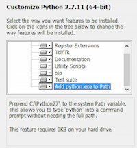

Installation
============

Before installing cbapi, make sure that you have access to a working VMWare Carbon Black EDR or App Control server.
The server can be either on-premise or in the cloud. EDR clusters are also supported. Once you have access to a working
server, you can use the standard Python packaging tools to install cbapi on your local machine.

Feel free to follow along with this document or watch the
`Development Environment Setup video <https://developer.carbonblack.com/guide/enterprise-response/development-environment-video/>`_
on the Developer Network website.

If you already have Python installed, you can skip right down to "Using Pip".

Installing Python
-----------------

Obviously the first thing you’ll need to do is install Python on your workstation or server. We recommend
using the latest version of Python 3 (as of this writing, 3.6.4) for maximum performance and compatibility.
Linux and Mac OS X systems will most likely have Python installed; it will have to be installed on Windows separately.

Note that cbapi is compatible with both Python 2.7 and Python 3.x. If you already have Python 3 installed on your
system, you're good to go!

If you believe you have Python installed already, run the following two commands at a command prompt::

    $ python --version
    Python 3.6.4

    $ pip --version
    pip 9.0.1 from /usr/local/lib/python3.6/site-packages (python 3.6)

If “python” reports back a version of 2.6.x, 2.7.x, or 3.x.x, you’re in luck.
If “pip” is not found, don’t worry, we’ll install that shortly.

If you're on Windows, and Python is not installed yet, download the latest Python installer from the python.org website.
We recommend using the latest version of Python 3. As of this writing, the latest version available is 3.6.4.
The direct link for the Python 3.6.4 installer for Windows 64-bit platforms is
https://www.python.org/ftp/python/3.6.4/python-3.6.4-amd64.exe.

Ensure that the "Add Python to PATH" option is checked.

If for some reason you do not have pip installed, follow the instructions at this
`handy guide <http://docs.python-guide.org/en/latest/starting/installation/>`_.

Using Pip
---------

Once Python and Pip are installed, then open a command prompt and type::

    $ pip install cbapi

This will download and install the latest version of cbapi from the Python PyPI packaging server.

Getting the Source Code
-----------------------

cbapi is actively developed on GitHub and the code is available from the
`carbonblack GitHub repository <https://github.com/carbonblack/cbapi-python>`_. The version of cbapi on GitHub will
reflect the latest development version of cbapi and may contain bugs not present in the currently released version.
On the other hand, it may contain exactly the goodies you're looking for (or you'd like to contribute back; we
are happy to accept pull requests!)

To clone the latest version of the cbapi repository from GitHub::

    $ git clone https://github.com/carbonblack/cbapi-python.git

Once you have a copy of the source, you can install it in "development" mode into your Python site-packages::

    $ cd cbapi-python
    $ python setup.py develop

This will link the version of cbapi-python you checked out into your Python site-packages directory. Any changes you
make to the checked out version of cbapi will be reflected in your local Python installation. This is a good choice
if you are thinking of changing or developing on cbapi itself.

